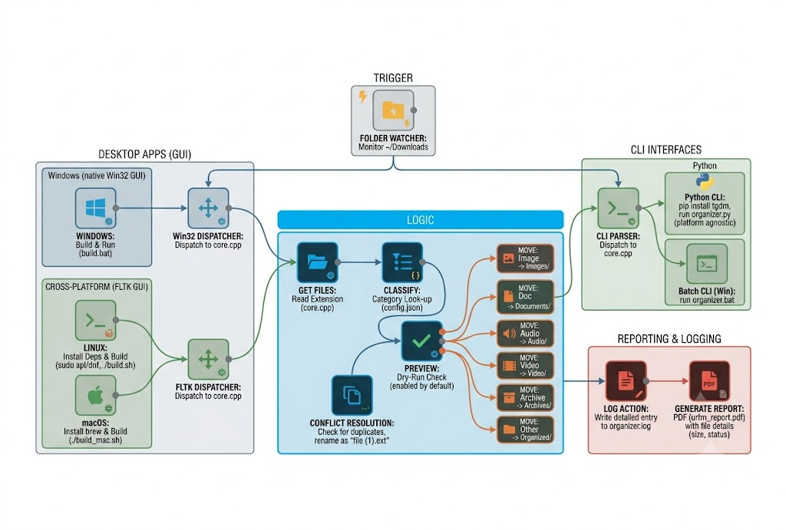

# urFileManager (urFM)

A cross-platform, native C++ utility that organizes cluttered folders into categorized subdirectories — Images, Documents, Audio, Video, Archives — in seconds. Comes with a polished GUI, CLI mode, dry-run preview, PDF reports, and 6 stunning themes.

**Platforms:** Windows (native Win32 GUI) · Linux (Java Swing GUI · FLTK GUI alt.)

## Features

- **Smart Extension Sorting** — Moves loose files into category folders based on customizable rules in `config.json`
- **Dry-Run Preview** — Preview every move before committing (enabled by default for safety)
- **PDF Reports** — Generate detailed organization reports with file names, sizes, and status
- **Full Audit Logging** — Every action recorded in `organizer.log` with timestamps
- **Conflict Resolution** — Duplicates renamed automatically (e.g. `report (1).pdf`)
- **Six UI Themes** — Midnight Dark, Minimalist Light, Red Sakura, Forest Emerald, Neon Cyberpunk, Obsidian Volt
- **Editable Config** — Add file types or categories via `config.json` — no recompile needed
- **GUI + CLI Modes** — Double-click for the GUI, or pass a folder path for scripting

## Project Structure

```
├── frontend-web/              # React + Vite marketing site
│   ├── src/
│   └── public/
├── frontend-desktop/          # Desktop GUI applications
│   ├── gui_win32.cpp          # Windows native Win32 GUI (C++)
│   ├── gui_fltk.cpp           # Cross-platform FLTK GUI (C++, Linux)
│   ├── gui.cpp                # GUI redirect (platform dispatch)
│   ├── core.h / core.cpp      # Shared cross-platform logic
│   ├── build.bat              # Windows build script
│   ├── build.sh               # Linux build script
│   ├── ufmgr.bat              # Windows CLI wrapper
│   ├── run.bat                # Windows GUI launcher
│   ├── ufmgr.rc               # Windows resource file
│   └── ufmgr.manifest         # Windows manifest
├── frontend-desktop-java/     # Linux Java Swing GUI (terminal aesthetic)
│   ├── src/urfm/              # Java sources
│   ├── build.sh               # Java build script
│   ├── MANIFEST.MF            # JAR manifest
│   └── RELEASE_README.md      # Quick start
├── organizer.py               # Python CLI (cross-platform)
├── config.json                # Sorting rules configuration
├── scripts/                   # Release automation
└── release/                   # Release binaries
```

## Workflow Diagram


## Quick Start

### Windows

1. Download `urfm-windows.zip` from the [website](https://urfilemanager.vercel.app) or via CLI:

```powershell
# PowerShell
Invoke-WebRequest -Uri "https://urfilemanager.vercel.app/urfm-windows.zip" -OutFile "urfm-windows.zip"
```

```cmd
curl -L -o urfm-windows.zip "https://urfilemanager.vercel.app/urfm-windows.zip"
```

2. Extract anywhere
3. Double-click `run.bat` to launch the GUI, or use:

```powershell
.\ufmgr.exe C:\Downloads --dry-run
```

### Linux (Java Terminal Edition — recommended)

```bash
# Install Java 17+ runtime
sudo apt install openjdk-17-jre   # Ubuntu
sudo dnf install java-17-openjdk  # Fedora

# Download & run (no compilation needed)
chmod +x urfm
./urfm ~/Downloads --dry-run
```

### Linux (FLTK Edition — alternative)

```bash
# Install FLTK dependency
sudo apt install libfltk1.3-dev   # Ubuntu
sudo dnf install fltk-devel       # Fedora

# Build and run
cd frontend-desktop
chmod +x build.sh
./build.sh
./urfm ~/Downloads --dry-run
```

## Building from Source

### Windows (native Win32 GUI)

Requires MinGW-w64 with `windres`.

```cmd
cd frontend-desktop
build.bat
```

### Linux — Java Terminal Edition

```bash
cd frontend-desktop-java
chmod +x build.sh
./build.sh
# Produces urfm.jar + urfm launcher
```

### Linux — FLTK GUI (alternative)

```bash
cd frontend-desktop
chmod +x build.sh
./build.sh
```

### Python (cross-platform CLI)

Works on all platforms without compilation.

```bash
pip install tqdm
python organizer.py ~/Downloads
```

## Releasing (website downloads)

Release archives must live in `frontend-web/public/` so Vite copies them into the deployed site.

```powershell
# From project root — builds Windows EXE if needed, packages all platforms
.\scripts\package-release.ps1

# Or from frontend-web/
npm run release
```

Then commit `frontend-web/public/urfm-*.zip`, `urfm-*.tar.gz`, and `downloads.json`, and push to redeploy.

Made with ❤️ by @N-PCs 

## License

MIT
