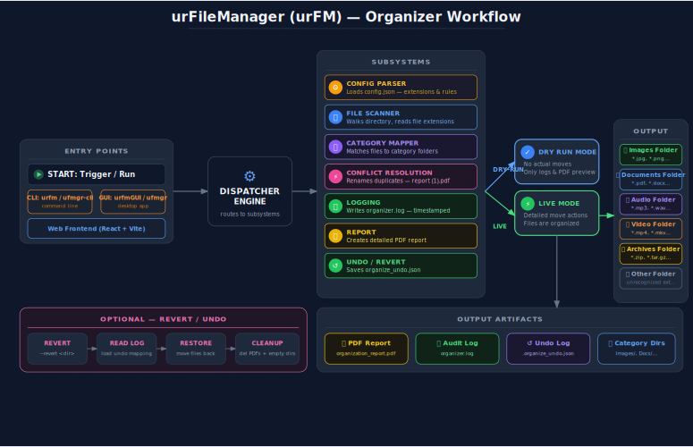

# urFileManager (urFM)


A cross-platform bulk file organizer that sorts cluttered folders into neat category sub-directories — **Images**, **Documents**, **Audio**, **Video**, **Archives** (and an `Other/` bucket for anything unrecognized) — in seconds. It ships with a polished GUI and a fully scriptable CLI, a safe dry-run preview, color-coded output, PDF reports, an audit log, and an undo/revert feature.

**Platforms:** Windows (Native C++ Win32 GUI) · Linux (Java Swing GUI with Fedora RPM & Ubuntu DEB support)

---

## Table of Contents

- [Features](#-features)
- [Workflow](#workflow)
- [Project Structure](#-project-structure)
- [Download](#-download)
  - [Via Command Line](#via-command-line)
  - [Package Manager Install (Linux)](#package-manager-install-linux)
- [Usage](#-usage)
  - [Windows](#windows)
  - [Linux](#linux)
- [Building from Source](#-building-from-source)
  - [Windows (MinGW-w64)](#windows-mingw-w64)
  - [Linux — Java Swing](#linux--java-swing)
  - [Linux — RPM / DEB packaging](#linux--rpm--deb-packaging)
  - [Website (frontend-web)](#website-frontend-web)
- [Configuration](#️-configuration)
- [How It Works](#-how-it-works)
- [Troubleshooting](#-troubleshooting)
- [License](#-license)

---

## Features

- **Smart Extension Sorting** — Moves loose files into category folders based on customizable rules in `config.json`.
- **Dry-Run Preview** — Preview every move before committing (enabled by default for safety).
- **PDF Reports** — Generates detailed organization reports (`organization_report.pdf` / `organization_report_preview.pdf`) with file names, sizes, and status.
- **Full Audit Logging** — Every action is recorded in `organizer.log` / console with timestamps.
- **Conflict Resolution** — Duplicate filenames are renamed automatically (e.g. `report (1).pdf`).
- **Six UI Themes** — Midnight Dark, Minimalist Light, Red Sakura, Forest Emerald, Neon Cyberpunk, Obsidian Volt.
- **Editable Config** — Add file types or categories via `config.json` — no recompile needed.
- **GUI + CLI Modes** — Double-click for the GUI, or pass a folder path to the CLI for scripting.
- **Undo / Revert** — Reverts the last organization, moving files back and cleaning up the category folders and PDF reports.
- **Color-Coded Output** — Status-aware console colors (`[DRY-RUN]`, `[MOVED]`, `[ERROR]`) that auto-disable when piped or when `NO_COLOR` is set.

---
## Workflow Diagram


---

## Project Structure

```
urFileManager/
├── desktop-windows/            # Windows C++ desktop apps (MinGW-w64)
│   ├── gui_app.cpp             # Windows native Win32 GUI (C++) -> ufmgr.exe
│   ├── cli.cpp                 # Windows CLI (C++) -> ufmgr-cli.exe
│   ├── urfm_common.cpp / .h    # Shared engine (config, PDF report, revert)
│   ├── config.json             # Sorting rules (edit to customize)
│   ├── build.bat               # Windows build script (MinGW-w64)
│   ├── run.bat                 # Windows GUI launcher
│   ├── ufmgr.bat               # Windows CLI wrapper (forwards to ufmgr-cli.exe)
│   ├── ufmgr.rc / .manifest    # Windows resource file + manifest
│   ├── ufmgr.ico               # Application icon
│   └── windows_usage.md        # Windows usage guide
├── desktop-linux/              # Linux Java Swing GUI (terminal aesthetic)
│   ├── src/urfm/               # Java sources
│   │   ├── Main.java           # Entry point / dispatcher (GUI vs CLI)
│   │   ├── Cli.java            # Command-line interface
│   │   ├── Console.java        # ANSI color helper
│   │   ├── ColoredLogger.java  # Colorizes engine messages
│   │   ├── OrganizerEngine.java# Does the moving + PDF generation
│   │   ├── ConfigParser.java   # Parses config.json
│   │   └── UrfmGUI.java        # Swing GUI
│   ├── build.sh                # Java build script
│   ├── build-tarball.sh        # Portable tarball builder
│   ├── build-rpm.sh            # Fedora RPM builder
│   ├── build-deb.sh            # Ubuntu DEB builder
│   ├── install.sh / launcher.sh / publish.sh
│   ├── MANIFEST.MF             # JAR manifest
│   ├── urfm.desktop / urfm-icon.svg
│   └── linux_usage.md          # Linux usage guide
├── frontend-web/               # React + Vite marketing / docs site
│   ├── src/                    # App source (components, data)
│   ├── public/                 # Static assets + release bundles (urfm-*.zip, etc.)
│   ├── package.json
│   └── README.md
├── config.json                 # Root sorting rules configuration (reference copy)
├── scripts/                    # Release automation
│   ├── package-release.sh      # Builds + packages for website downloads
│   └── package-release.ps1
└── release/                    # Release binaries (git-ignored)
```

> Binaries (`.exe`, `.jar`), build outputs (`build/`, `dist/`, `*.o`), logs (`*.log`),
> and generated PDFs are git-ignored — see [`.gitignore`](.gitignore).

---

## Download

### Via Command Line

Download the release archive straight from your terminal:

| Platform | Command |
|----------|---------|
| Windows (PowerShell) | `Invoke-WebRequest -Uri "https://urfilemanager.vercel.app/urfm-windows.zip" -OutFile "urfm-windows.zip"` |
| Windows (CMD) | `curl -L -o urfm-windows.zip "https://urfilemanager.vercel.app/urfm-windows.zip"` |
| Linux (curl) | `curl -LO "https://urfilemanager.vercel.app/urfm-linux.tar.gz"` |
| Linux (wget) | `wget -O urfm-linux.tar.gz "https://urfilemanager.vercel.app/urfm-linux.tar.gz"` |

### Package Manager Install (Linux)

**Fedora / RHEL (.rpm):**
```bash
sudo dnf install ./urfm-1.0.0-1.noarch.rpm
```

**Ubuntu / Debian (.deb):**
```bash
sudo apt install ./urfm_1.0.0_all.deb
```

> RPM/DEB installs place `urfm` on your `PATH` (`/usr/local/bin/urfm`) and add an app-menu entry.

---

## Usage

### Windows

1. Download and extract `urfm-windows.zip` anywhere.
2. Both `ufmgr.exe` and `ufmgr-cli.exe` read `config.json` from their own folder.

**GUI (`ufmgr.exe`)**
- Double-click `run.bat` or `ufmgr.exe`.
- Click **Browse**, pick a folder, then **Start Organizing**.
- **Dry Run** is checked by default — uncheck it to actually move files.
- Use **Undo Last Organize** to revert (also removes the generated PDF and empties category folders).
- Switch themes and view the audit log from the GUI.

**CLI (`ufmgr-cli.exe`)**

| Command | Description |
|---------|-------------|
| `ufmgr-cli.exe "C:\Downloads"` | Preview organization (safe — dry-run is the default) |
| `ufmgr-cli.exe "C:\Downloads" --no-dry-run` | Actually move files into category folders |
| `ufmgr-cli.exe --revert "C:\Downloads"` | Undo a previous organization of that folder |
| `ufmgr-cli.exe -h` | Show help |

Both `--flag` and `-flag` syntaxes are accepted. Output is color-coded and writes `organizer.log` plus a PDF report into the target folder.

### Linux

**Tarball:** `tar -xzf urfm-linux.tar.gz && cd urfm-linux && chmod +x urfm && ./urfm`
**RPM/DEB:** Launch **urFileManager** from the app menu, or run `urfm` in a terminal. Requires Java 17+.

| Command | Description |
|---------|-------------|
| `urfm` | Launch the Java Swing GUI |
| `urfm ~/Downloads` | Organize the target directory (live run) |
| `urfm ~/Downloads --dry-run` | Preview moves & generate a preview PDF (no filesystem changes) |
| `urfm ~/Downloads --revert` | Undo the last organization on that folder |
| `urfm --gui` | Force open the GUI even when a directory argument is given |
| `urfm --version` | Print the app version and exit |
| `urfm -h` / `urfm --help` | Show full help and exit |

A live run saves an undo log (`.organize_undo.json`); `--revert` reads it and restores files, then cleans up the PDF reports and any now-empty category folders.

---

## Building from Source

### Windows (MinGW-w64)

Requires MinGW-w64 with `windres` on your `PATH`.

```cmd
cd desktop-windows
build.bat
```

Produces `ufmgr.exe` (GUI) and `ufmgr-cli.exe` (CLI).

### Linux — Java Swing

Requires JDK 17+.

```bash
cd desktop-linux
chmod +x build.sh
./build.sh
# Produces urfm.jar + urfm launcher
```

### Linux — RPM / DEB packaging

```bash
cd desktop-linux
./build-rpm.sh      # Fedora/RHEL (.rpm) — needs rpmbuild (installs it if missing)
./build-deb.sh      # Ubuntu/Debian (.deb)
```

### Website (frontend-web)

```bash
cd frontend-web
npm install
npm run dev         # local dev server
npm run build       # production build -> dist/
```

---

## Configuration

Sorting rules live in `config.json`. The app looks it up in this order:

- **Windows:** next to the executable.
- **Linux:** next to `urfm.jar` → its parent folder → current working directory.

Map each category name to a list of **lowercase** extensions:

```json
{
  "Images": [".jpg", ".jpeg", ".png", ".gif", ".webp", ".svg"],
  "Documents": [".pdf", ".docx", ".doc", ".txt", ".xlsx", ".pptx"],
  "Audio": [".mp3", ".wav", ".aac", ".flac", ".m4a"],
  "Video": [".mp4", ".mkv", ".mov", ".avi", ".webm"],
  "Archives": [".zip", ".tar.gz", ".rar", ".7z", ".tar"]
}
```

- Files with unrecognized extensions land in an `Other/` folder.
- After editing `config.json`, restart the GUI or re-run the CLI to reload the rules.

---

## How It Works

1. You point the app at a folder (via the GUI or CLI).
2. It reads `config.json` and builds a category → extension map.
3. In **dry-run** mode it shows (and reports) exactly which file *would* move where, without touching the disk.
4. In **live** mode it moves each file into its category sub-folder, renames duplicates, writes a PDF report, and saves an undo log.
5. **Revert** reads the undo log and moves everything back, then cleans up reports and empty folders.

---

## Troubleshooting

**Windows**
- *Antivirus blocks the `.exe`* — add an exception for the extracted folder.
- *Missing DLL errors* — make sure you extracted the whole ZIP (the binaries are self-contained; no runtime is required).

**Linux**
- *`Java 17+ not found`* — install a JRE/JDK: `sudo dnf install java-17-openjdk` (Fedora) or `sudo apt install openjdk-17-jre` (Ubuntu).
- *GUI won't open (headless/SSH)* — the GUI needs a full (headful) JDK and a display. The `urfm` launcher auto-prefers `java-latest-openjdk`; over SSH use `ssh -X user@host`. Otherwise use CLI mode.
- *`build-rpm.sh` says rpmbuild required* — `sudo dnf install rpm-build redhat-rpm-config`.
- *No colors in output* — you're piping/redirecting (auto-off) or `NO_COLOR` is set. Override with `java -Durfm.forceColor=true -jar urfm.jar ~/Downloads --dry-run`.

---

## License

MIT

Made by @N-PCs for the world 🌍 ❤️
